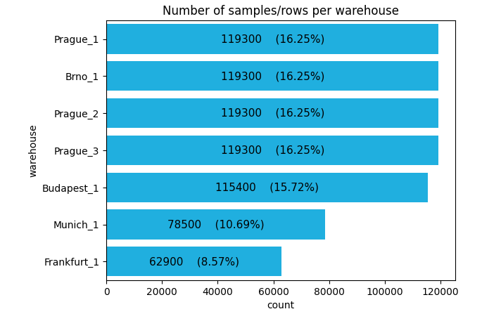
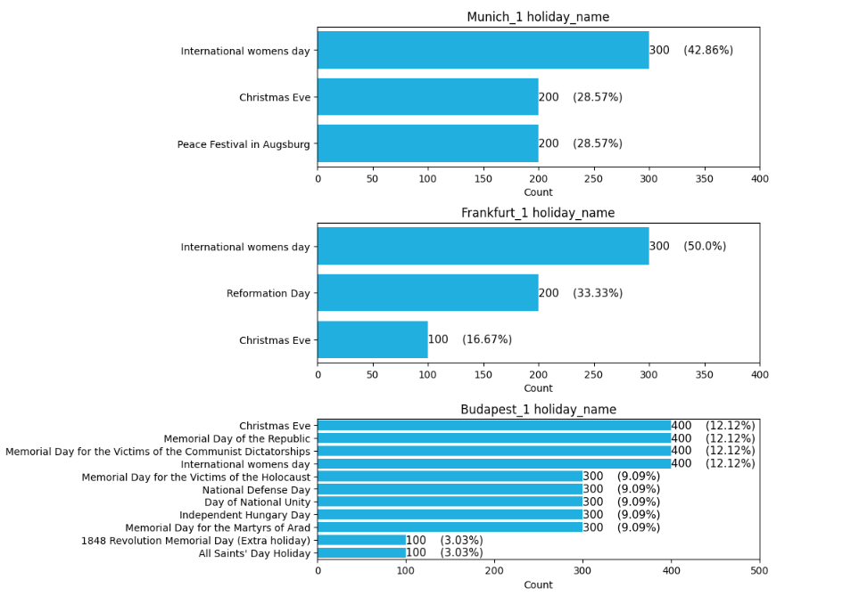
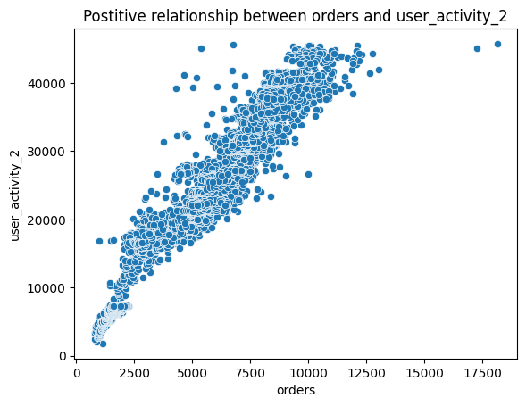
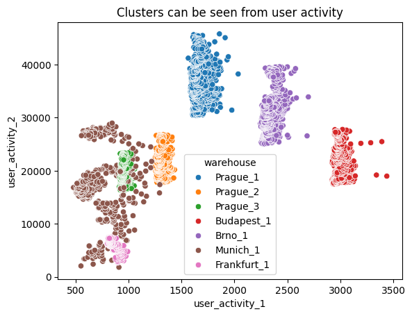
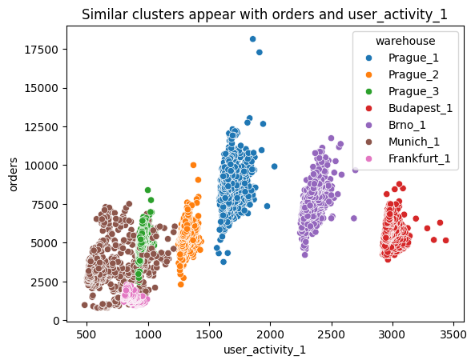
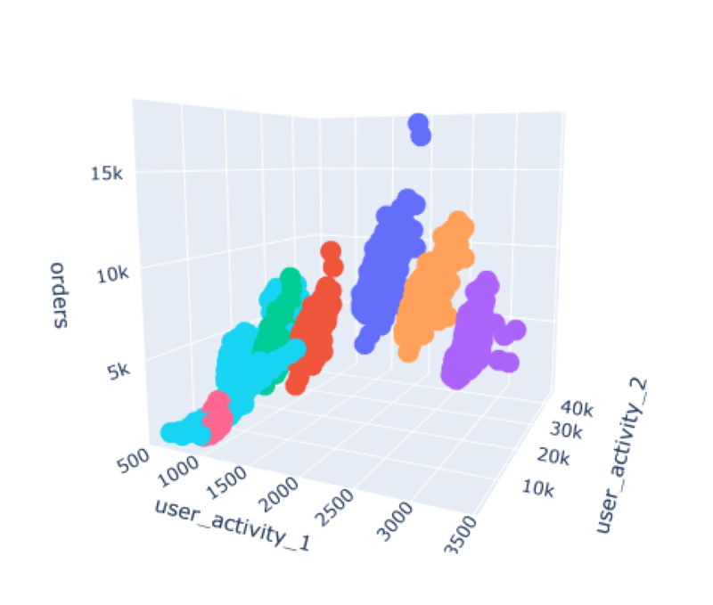

### Project Title

**Author** Kiran Nazarali

#### Executive summary
This project investigates whether historical order patterns can be used to accurately forecast future demand for Rohlik’s e-grocery services. Using exploratory analysis, feature engineering, and a mix of regression and time-series models, the goal is to build a reliable forecasting pipeline that improves operational planning, reduces waste, and enhances supply-chain efficiency.

#### Rationale
_Why should anyone care about this question?_
Accurate demand forecasting reduces inventory waste, prevents stockouts, and improves operational efficiency. Accurate order forecasts are crucial for planning processes, as they impact workforce allocation, delivery logistics, inventory management, and overall supply chain efficiency. By exploring patterns in historical orders, I aim to predict future demand more reliably, helping optimize operations and minimize waste.

#### Research Question
_What are you trying to answer?_
The research question I intend to answer is: Can historical order data be used to accurately predict future orders for Rohlik’s e-grocery services? 

#### Data Sources
_What data will you use to answer you question?_ 
I will use the historical order data provided in the Rohlik Orders Forecasting Challenge on Kaggle link: https://www.kaggle.com/competitions/rohlik-orders-forecasting-challenge/data

#### Methodology
_What methods are you using to answer the question?_
The analysis will begin with exploratory data analysis (EDA). I will use feature engineering to create relevant predictors. I plan to use Linear Regression and Polynomial Regression to capture baseline trends, as well as ARIMA and SARIMAX for time-series forecasting. GridSearchCV will optimize model parameters to identify the best-performing approach.

#### Results
_What did your research find?_
#### EDA Findings
- We have 2 datasets for training: train_orders_data and train_calendar. 
    - All 7340 data points in the train_orders_data are also in the train_calendar.
    - There are some amount of holidays and additional incomplete non-holiday data points that are in the train_calendar, but not in the train_orders_data.
    - The train_orders data also has user activity 1 and user activity 2 features which train_calendar does not have.
    - If needed, we could later on experiment imputing the values for these 2 features and increase our train_orders_dataset

- There are 5 warehouses Brno_1, Budapest_1,Frankfurt_1	0, Munich_1	0, Prague_1, Prague_2, and Prague_3. The Munich_1 and Frankfurt_1 do not have as many holidays as the other warehouses.

  

  

- There is a strong positive relationship and correlation between user_activity_2 feature and our target feature orders.
  

  

- We can see 2D clusters using user_activity_1 and user_activity_2. We can also see 2D clusters with orders and user_activity_1 features. If we combine user_activity_1, user_activity_2, and orders, then we can observe 3D clusters

  

  

  

- Shutdown, mini_shutdown, blackout, and frankfurt_shutdown are rare occurences. Snow and precipitation and holiday-related variables occur seasonally.
- The final test data set includes fewer features than in the provided train_orders_data and train_calendar.

**Baseline Model:** A baseline linear regression model to predict the next 60 days orders had a performance of 57% accuracy. 

#### Next steps
_What suggestions do you have for next steps?_
The next steps will include feature engineering with Linear Regression and Polynomial Regression. I will also explore next ARIMA and SARIMAX for time-series forecasting GridSearchCV will optimize model parameters to identify the best-performing approach.

#### Outline of project

- [Link to notebook 1](https://drive.google.com/file/d/1uw7RHTfkNbj5KGzMwynhLgRPwwhd0LsA/view?usp=sharing)

##### Contact and Further Information
