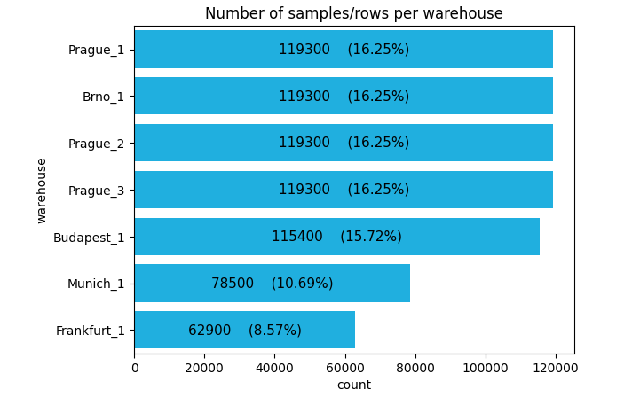
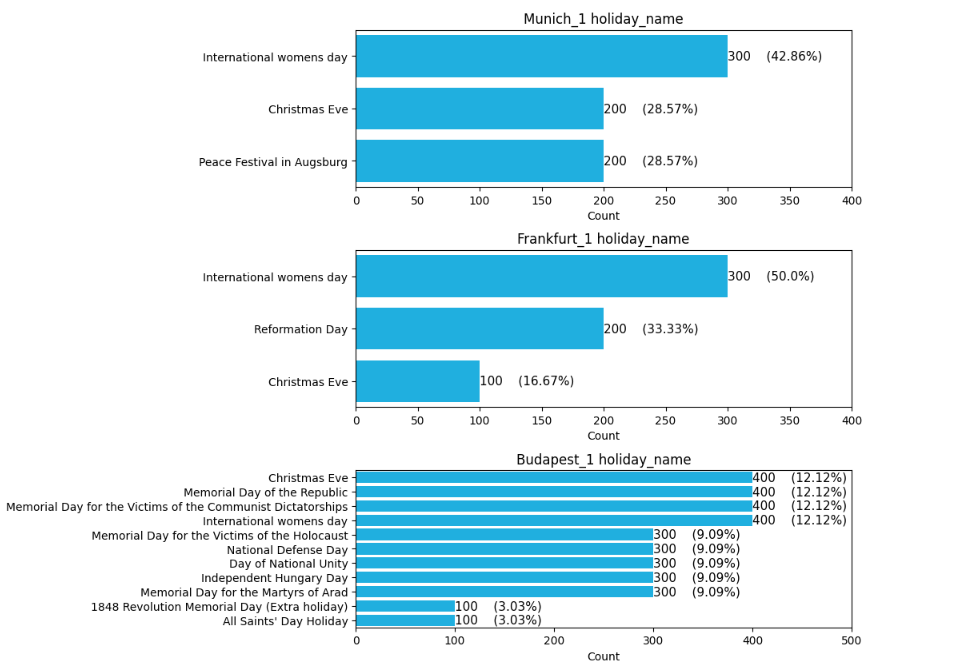
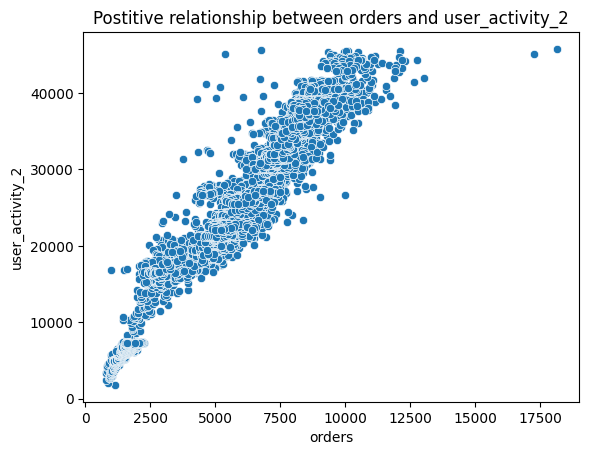
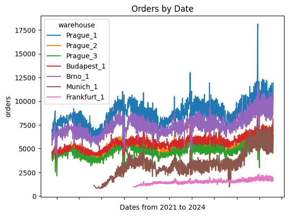
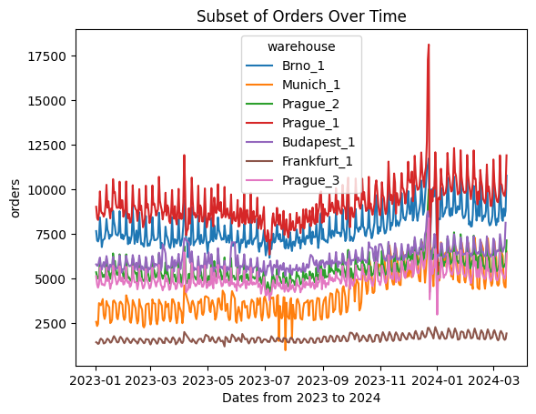
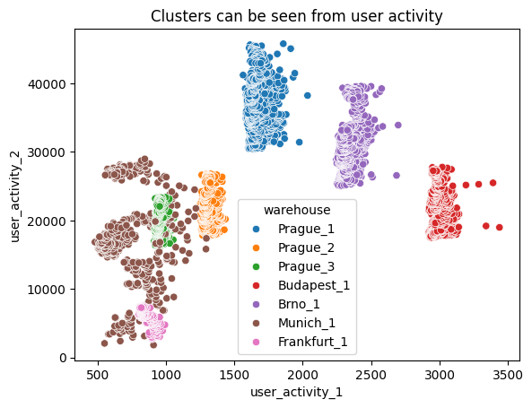
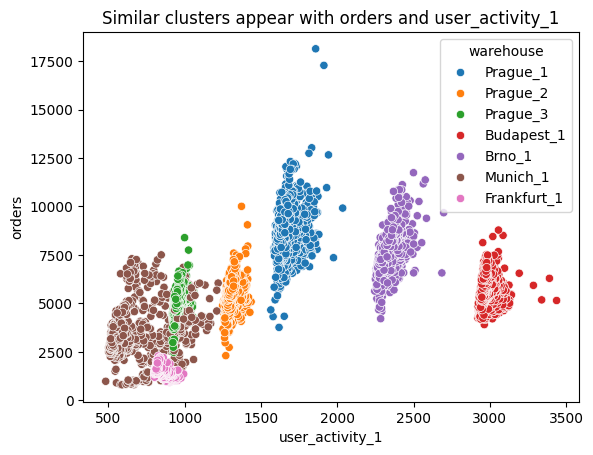
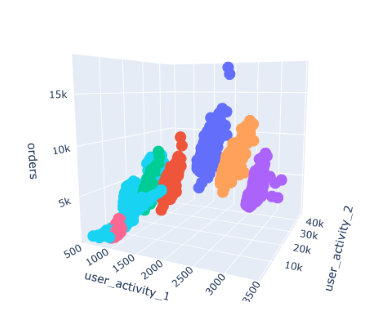

### Project Title

**Author** Kiran Nazarali

#### Executive summary
This project evaluates whether historical order data can be used to reliably forecast future demand for Rohlik’s e-grocery operations. Accurate demand forecasting is critical for Rohlik, as even small forecast errors can lead to inventory waste, stockouts, inefficient staffing, and higher delivery costs.

Using historical order patterns across seven warehouses, I built and compared multiple forecasting approaches, including regression models and time-series methods. The analysis shows that demand is highly predictable when daily and weekly seasonality is explicitly modeled. Seasonal time-series models particularly SARIMAX consistently outperformed non-seasonal and purely machine-learning approaches.

The final SARIMAX models reduced forecasting error to approximately 7% WAPE, demonstrating that historical order behavior alone provides strong signal for operational planning. These results suggest that Rohlik can meaningfully improve inventory planning, labor allocation, and delivery efficiency by adopting seasonality-aware forecasting models at the warehouse level.

#### Rationale
_Why should anyone care about this question?_
Demand forecasting directly impacts Rohlik’s core operations. Over-forecasting leads to excess inventory, food waste, and unnecessary labor costs, while under-forecasting results in stockouts, delayed deliveries, and poor customer experience. Because Rohlik operates on thin margins and high delivery volumes, improving forecast accuracy, even by a few percentage points, can translate into significant cost savings and service improvements.

This project focuses on understanding whether historical order data alone can support accurate forecasts and which modeling approaches best align with Rohlik’s operational needs

#### Research Question
_What are you trying to answer?_
The research question I intend to answer is: Can historical order data be used to accurately predict future orders for Rohlik’s e-grocery services? 

#### Data Sources
_What data will you use to answer you question?_ 
I used the historical order data provided in the Rohlik Orders Forecasting Challenge on Kaggle link: https://www.kaggle.com/competitions/rohlik-orders-forecasting-challenge/data

#### Methodology
_What methods are you using to answer the question?_
I began with exploratory data analysis (EDA) to identify trends, seasonality, and anomalies in historical order volumes. This revealed strong daily and weekly seasonal patterns, as well as longer-term trends, motivating the use of time-series–based approaches.

Next, I performed feature engineering to construct time-based predictors, including calendar effects and seasonal indicators. To identify the most informative exogenous variables, I applied LASSO regression, sequential feature selection (SFS), and permutation importance, ensuring that only features with meaningful predictive value were retained.

For modeling, I first established baselines using ARIMA and SARIMA to capture autocorrelation and seasonality in the order series. I then extended these models to SARIMAX, incorporating the selected exogenous features to jointly model temporal structure and external drivers of demand. In parallel, I evaluated regression-based models and Prophet to compare performance across different modeling paradigms.

Model performance was assessed using appropriate forecasting error metrics, and hyperparameter optimization was conducted to ensure fair comparisons. The final evaluation focuses on identifying the model that best balances accuracy, robustness, and interpretability for operational demand forecasting.

#### Results
_What did your research find?_
#### EDA Findings
- We have 2 datasets for training: train_orders_data and train_calendar. 
    - All 7340 data points in the train_orders_data are also in the train_calendar.
    - There are some amount of holidays and additional incomplete non-holiday data points that are in the train_calendar, but not in the train_orders_data.
    - The train_orders data also has user activity 1 and user activity 2 features which train_calendar does not have.
    - If needed, we could later on experiment imputing the values for these 2 features and increase our train_orders_dataset

- There are 5 warehouses Brno_1, Budapest_1,Frankfurt_1	0, Munich_1	0, Prague_1, Prague_2, and Prague_3. The Munich_1 and Frankfurt_1 do not have as many holidays as the other warehouses.

  

  

- There is a strong positive relationship and correlation between user_activity_2 feature and our target feature orders.
  

  

- The orders over time follow slightly different trajectories based on the warehouse.
  

  

  

  

- We can see 2D clusters using user_activity_1 and user_activity_2. We can also see 2D clusters with orders and user_activity_1 features. If we combine user_activity_1, user_activity_2, and orders, then we can observe 3D clusters

  

  

  

- Shutdown, mini_shutdown, blackout, and frankfurt_shutdown are rare occurences. Snow and precipitation and holiday-related variables occur seasonally.
- The final test data set includes fewer features than in the provided train_orders_data and train_calendar.

### Models

#### Baseline Model
A baseline linear regression model was trained to predict order volume for the next 60 days. This model achieved approximately **57% accuracy**, only marginally better than a naive baseline, indicating that simple linear assumptions without explicit temporal structure are insufficient for capturing demand dynamics.

### Model Comparison

To evaluate predictive performance, multiple statistical and machine-learning models were compared primarily using **WAPE**.

Weighted Absolute Percentage Error (WAPE) was chosen as the primary evaluation metric because it aligns closely with business decision-making. A WAPE of 7% means forecasts are off by 7% on average, which is easy for non-technical stakeholders to understand. Larger demand days and warehouses contribute proportionally more to the error, reflecting their greater operational impact. WAPE allows fair comparison between warehouses with different order volumes. Metrics such as R² or RMSE are useful for diagnostics but are less intuitive when translating forecast accuracy into inventory, staffing, and logistics decisions. WAPE provides the most actionable signal for operational planning.

#### Initial Model Performance

| Model | MAE | WAPE (%) | R² |
|------|-----|----------|----|
| Ridge Regression | 590.95 | 9.45 | 0.9045 |
| LightGBM | 1701.85 | 27.20 | 0.2653 |
| ARIMA | 594.91 | 9.51 | 0.9044 |
| SARIMA | 439.87 | 7.03 | 0.9444 |
| SARIMAX | 1409.60 | 22.53 | 0.6025 |
| Prophet | 607.18 | 9.71 | 0.8985 |

Among the initial models, **SARIMA** outperformed alternatives, demonstrating that explicitly modeling **seasonality** is critical for accurate demand forecasting. Pure machine-learning approaches, such as LightGBM, underperformed without extensive feature engineering, highlighting the importance of temporal inductive bias in this setting.

### Improved Model Performance

Following hyperparameter tuning, feature refinement, and warehouse-level model separation, performance improved substantially:

| Model | Mean RMSE | Mean WAPE (%) |
|------|-----------|----------------|
| ARIMA | 949.08 | 13.0 |
| SARIMA | 784.29 | 8.4 |
| Linear Regression | 560.77 | 9.7 |
| SARIMAX | **452.31** | **7.1** |

The **SARIMAX** model achieved the best overall performance, delivering the lowest error across warehouses.

### Key Insights

- Strong **daily and weekly seasonality** in order volume made seasonal time-series models significantly more effective than non-seasonal alternatives.
- Lagged demand features—specifically **1-day, 7-day, and 14-day lags**—were among the strongest predictors, confirming the persistence of short-term ordering behavior.
- Modeling each of the **seven warehouses independently** substantially improved accuracy, suggesting heterogeneous demand patterns across locations.
- While regression models benefited from lag-based features, **SARIMAX** best captured both temporal structure and exogenous signals, resulting in the most accurate and robust forecasts.

Overall, the results demonstrate that combining seasonal time-series modeling with carefully selected lagged features yields the most reliable demand forecasts for Rohlik’s e-grocery operations.

### Recommendations
Based on the findings, the following actions are recommended:
- **Adopt seasonal forecasting models at the warehouse level**
Implement SARIMA/SARIMAX-style models separately for each warehouse to improve local planning accuracy.
- **Use WAPE as the primary operational KPI for forecast quality**
This metric aligns forecasting performance with real business impact.
- **Prioritize short-term forecast accuracy for operational decisions**
Near-term forecasts show the highest reliability and should guide staffing, inventory, and delivery planning.

#### Next steps
_What suggestions do you have for next steps?_
- **Probabilistic forecasting and uncertainty estimation:**  
  Provide forecast ranges instead of single values to help operations teams plan inventory, staffing, and delivery capacity with clearer visibility into risk and variability.
- **Model ensembling:**  
  Combine multiple forecasting approaches to improve reliability during demand spikes, promotions, or seasonal shifts, reducing the likelihood of stockouts or overstaffing.
- **Multi-horizon optimization:**  
  Optimize forecasts for short-, medium-, and long-term horizons to better support daily operations, weekly planning, and longer-term supply chain decisions.

#### Outline of project

- [Link to notebook 1](https://drive.google.com/file/d/1uw7RHTfkNbj5KGzMwynhLgRPwwhd0LsA/view?usp=sharing)
- [Link to notebook 2]([https://drive.google.com/file/d/1uw7RHTfkNbj5KGzMwynhLgRPwwhd0LsA/view?usp=sharing](https://colab.research.google.com/drive/11VpUX4vJPWNw-Kcf8aMcJDFss7xzfwvB?usp=sharing))
- [Link to notebook 3]([https://drive.google.com/file/d/1uw7RHTfkNbj5KGzMwynhLgRPwwhd0LsA/view?usp=sharing](https://colab.research.google.com/drive/1VdFY0oYF53efa32cIdy77IUsGwv9jzvf?usp=sharing))

##### Contact and Further Information
